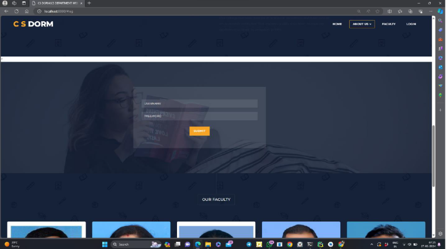
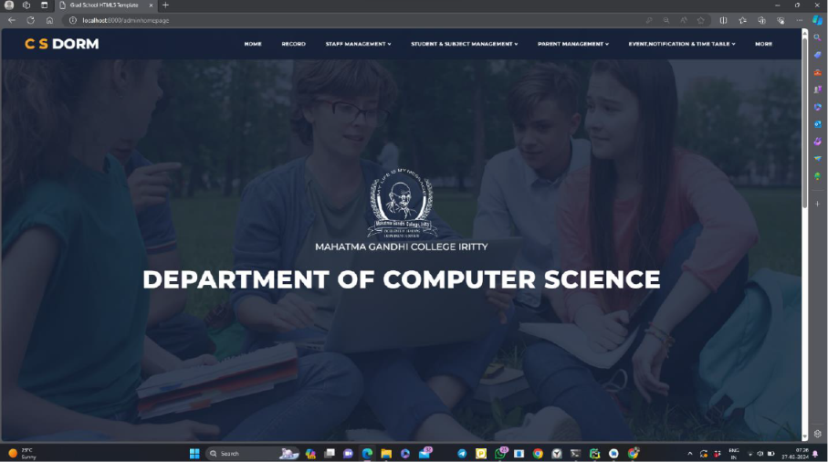
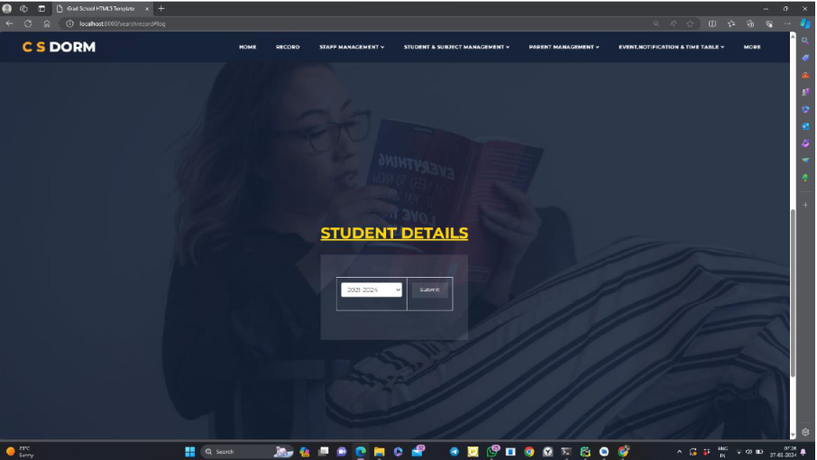
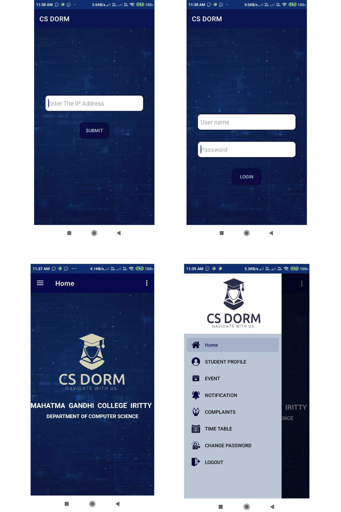

# CS DORM -- College Department Management System

CS DORM is a comprehensive **College Department Management System**
developed for the **Computer Science Department of Mahatma Gandhi
College, Iritty**. The system is designed to streamline departmental
administration by providing a centralized platform for managing
students, staff, parents, subjects, academic records, attendance,
events, notifications, complaints, and other departmental information.

The project was developed as a **B.Sc. Computer Science academic project
(2023--2024)**.

## 📌 Project Overview

CS DORM addresses the difficulties of managing departmental information
through traditional paperwork and disconnected records. It provides
centralized data storage and retrieval, including information from
previous academic years, making historical records easier to access and
manage.

The system supports different user roles and provides functionality
according to their responsibilities.

## ✨ Key Features

### 👨‍💼 Admin / HOD

-   Secure login and role-based access
-   Manage student, staff, parent, and subject details
-   Allocate tutors to batches
-   Allocate subjects to staff
-   Manage attendance and academic information
-   Manage timetable, events, and notifications
-   Retrieve previous academic-year student profiles and results
-   View and respond to complaints

### 👨‍🏫 Staff

-   Login to the system
-   Manage allocated batch information
-   Record student attendance
-   Enter internal marks
-   Upload subject-related study materials
-   View timetable, events, and notifications

### 🎓 Student

-   Secure login
-   View tutor and staff details
-   View current semester subjects
-   Access study materials
-   View timetable, events, and notifications
-   View internal marks and semester results
-   Register complaints

### 👪 Parent

-   Secure login
-   View child's tutor, subjects, semester, and staff details
-   View attendance records
-   View internal marks and semester results
-   View events and notifications
-   Register complaints

## 🧩 Main Modules

-   Authentication & Role Management
-   Student Management
-   Staff Management
-   Parent Management
-   Subject Management
-   Subject Allocation
-   Tutor Allocation
-   Attendance Management
-   Mark Management
-   Timetable Management
-   Parent Allocation
-   Notification Management
-   Event Management
-   Complaint Management
-   Study Material Management
-   Historical Data Management

## 🛠️ Technology Stack

### Frontend

-   HTML
-   CSS
-   JavaScript
-   Bootstrap
-   XML

### Backend / Programming

-   Python
-   Java

### Database

-   SQLite
-   SQL

### Development Tools

-   PyCharm
-   Android Studio
-   Adobe Dreamweaver

> **Note:** The original project report lists MySQL, Python, and Java
> under software requirements, while the backend/database development
> section specifically describes SQLite and Python. This README follows
> the technologies described across the project report without assuming
> an additional framework that is not documented.

## 🗄️ Database

The system uses a relational database design with structured tables and
relationships. The documented database includes entities such as:

-   Login
-   Staff
-   Student
-   Subject
-   Staff/Subject Allocation
-   Tutor Allocation
-   Attendance
-   Marks
-   External Marks
-   Parent
-   Parent Allocation
-   Events
-   Notifications
-   Complaints
-   Study Materials
-   Additional Student Information
-   Timetable

Primary keys and foreign keys are used to maintain relationships between
related records.

## 🔐 Security & Access

CS DORM provides authentication and role-based access so that
administrators, staff, students, and parents can access information
relevant to their roles. The system is designed around a centralized
repository to reduce data redundancy and improve information retrieval.

## 📊 System Design

The project includes:

-   Input and output design
-   Data Flow Diagrams (DFDs)
-   Database design
-   Normalization
-   Table design
-   System testing
-   Implementation and maintenance documentation

The documented database design applies normalization principles
including **1NF, 2NF, and 3NF**.

## 🧪 Testing

The project includes system testing to verify reliability and
functionality. Testing documented in the project includes:

-   Validation Testing
-   Output Testing
-   User Acceptance Testing

The system was tested using test data and live data, with errors
identified and corrected during development.

## 🚀 Future Scope

The system can be extended with additional functionality such as:

-   More advanced communication features
-   Enhanced notifications and alerts
-   Improved analytics and reporting
-   Additional academic management modules
-   Broader institutional data management
-   Improved mobile accessibility

## 🎓 Academic Information

**Project:** CS DORM\
**Institution:** Mahatma Gandhi College, Iritty, Kannur, Kerala\
**Department:** Computer Science\
**Degree:** B.Sc. Computer Science\
**Academic Year:** 2023--2024\
**Developer:** Renjini Thomas\
**Project Guide:** Ms. Anupama M

## 📷 Screenshots

Screenshots of the application's interfaces and modules are included in
the project documentation. For a GitHub repository, application
screenshots can be added here:

``` text
docs/
└── screenshots/
    ├── login.png
    ├── admin-dashboard.png
    ├── student-management.png
    ├── staff-management.png
    ├── attendance.png
    └── results.png
```

Then reference them in this section using standard Markdown image
syntax.

## 📁 Suggested Repository Structure

``` text
CS-DORM/
│
├── README.md
├── requirements.txt
├── database/
│   └── database.sql
├── static/
│   ├── css/
│   ├── js/
│   └── images/
├── templates/
├── src/
├── docs/
│   └── screenshots/
└── LICENSE
```

> The structure above is a recommended GitHub organization and may need
> to be adjusted to match the actual source-code structure.

## 👩‍💻 Developer

**Renjini Thomas**

B.Sc. Computer Science\
Mahatma Gandhi College, Iritty

------------------------------------------------------------------------

### ⭐ About the Project

CS DORM demonstrates the development of a centralized academic
department management platform combining web technologies, database
management, role-based access, and multiple academic administration
modules into a single system.

## 📷 Screenshots

### 🔐 Login



### 👨‍💼 Admin Dashboard



### 🎓 Student Management



### 👨‍🏫 Application for parents and students



### Home Page


